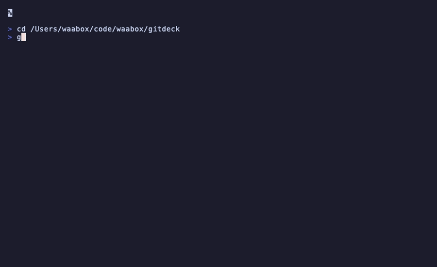

<p align="center">
  <a href="https://github.com/waabox/gitdeck/wiki">
    
  </a>
</p>

<p align="center">
  <strong>A terminal UI for monitoring CI/CD pipelines.</strong><br/>
  Run it from any git repository and get an instant overview of pipeline runs and job statuses — no browser required.
</p>

<p align="center">
  <a href="https://github.com/waabox/gitdeck/actions/workflows/ci.yml"></a>
  <a href="https://github.com/waabox/gitdeck/actions/workflows/release.yml"></a>
  <a href="https://github.com/waabox/gitdeck/releases/latest"></a>
  <a href="go.mod"></a>
  <a href="LICENSE"></a>
  <a href="https://github.com/waabox/gitdeck/wiki"></a>
</p>

<p align="center">
  
</p>

## Why gitdeck instead of the web UI?

- **No context-switching**: see pipelines, jobs and logs without leaving your terminal.
- **Keyboard-first**: rerun / cancel with a single keypress.
- **Works with both GitHub Actions and GitLab CI/CD** from the same tool.

## Quick Start

```bash
# Option A: Homebrew
brew tap waabox/gitdeck && brew install gitdeck

# Option B: One-liner install (requires Go 1.24+)
curl -sSL https://raw.githubusercontent.com/waabox/gitdeck/main/install.sh | bash

cd /path/to/your/repo
gitdeck
```

On first run gitdeck will authenticate via OAuth Device Flow — just open a link and enter a code.

## Features

- Live pipeline list with status icons and durations
- Job detail panel with per-job navigation
- Per-job step detail: press `enter` on a job to expand its individual steps inline
- Auto-refresh every 5 seconds
- Configurable number of pipelines to display (default: 3)
- OAuth Device Flow authentication for GitHub and GitLab (no manual token copy-paste)
- Config via `~/.config/gitdeck/config.toml` with environment variable overrides
- Auto-detects repository from the current working directory
- View full raw job logs in a fullscreen scrollable panel (press `l` on a job)
- Re-run or cancel any pipeline with a single keypress and inline confirmation

## Installation

### macOS (Homebrew)

```bash
brew tap waabox/gitdeck
brew install gitdeck
```

> **Note:** The binary is not yet signed with an Apple Developer certificate, so macOS may flag it as unverified. If that happens, remove the quarantine attribute:
> ```bash
> xattr -d com.apple.quarantine "$(readlink -f $(which gitdeck))"
> ```

### Linux (Debian/Ubuntu)

```bash
wget https://github.com/waabox/gitdeck/releases/latest/download/gitdeck_linux_amd64.deb
sudo dpkg -i gitdeck_linux_amd64.deb
```

For ARM64:

```bash
wget https://github.com/waabox/gitdeck/releases/latest/download/gitdeck_linux_arm64.deb
sudo dpkg -i gitdeck_linux_arm64.deb
```

### Linux (RPM — Fedora/RHEL)

```bash
sudo rpm -i https://github.com/waabox/gitdeck/releases/latest/download/gitdeck_linux_amd64.rpm
```

### Quick install (curl)

```bash
curl -sSL https://raw.githubusercontent.com/waabox/gitdeck/main/install.sh | bash
```

Clones the repo into a temp directory, builds from source, and installs the binary to `/usr/local/bin`. Requires **Git** and **Go 1.24+**.

### From source

```bash
git clone https://github.com/waabox/gitdeck.git
cd gitdeck
go build -o gitdeck ./cmd/gitdeck
mv gitdeck /usr/local/bin/
```

Requires Go 1.24 or later.

## Authentication

gitdeck ships with built-in OAuth credentials for **GitHub** and **GitLab**. On first run it starts the Device Flow automatically — just open a link and enter a code:

```
No GitHub token found. Starting OAuth authentication...
Visit:      https://github.com/login/device
Enter code: ABCD-1234
Waiting for authorization...
Authenticated. Token saved to /Users/you/.config/gitdeck/config.toml
```

The token is saved so subsequent runs are silent. No config file needed for the common case.

## Configuration

Optionally create `~/.config/gitdeck/config.toml` to customize behavior:

```toml
# Number of recent pipelines to show (default: 3)
pipeline_limit = 3

[github]
# Override the built-in OAuth Client ID with your own
# client_id = "YOUR_GITHUB_OAUTH_APP_CLIENT_ID"

[gitlab]
# Override the built-in OAuth Application ID with your own
# client_id = "YOUR_GITLAB_OAUTH_APP_CLIENT_ID"
# Only needed for self-hosted GitLab instances
# url = "https://gitlab.example.com"
```

### Environment variable overrides

| Variable       | Overrides        |
|----------------|------------------|
| `GITHUB_TOKEN` | `github.token`   |
| `GITLAB_TOKEN` | `gitlab.token`   |
| `GITLAB_URL`   | `gitlab.url`     |

### Using your own OAuth Apps

If you prefer to use your own OAuth credentials instead of the built-in ones:

**GitHub**: Create an OAuth App at *Settings → Developer settings → OAuth Apps*. Set the callback URL to `http://localhost`. Copy the Client ID into the config.

**GitLab**: Create an OAuth App at *User Settings → Applications*. Enable the `read_api` scope and tick *Allow Device Authorization Grant*. Copy the Application ID into the config.

## Keyboard shortcuts

| Key              | Action                                        |
|------------------|-----------------------------------------------|
| `↑` / `↓`        | Navigate pipelines or jobs / scroll logs      |
| `Enter`          | Select pipeline, focus job detail panel       |
| `Tab`            | Switch focus between panels                   |
| `l`              | View full logs for selected job (fullscreen)  |
| `r`              | Re-run selected pipeline (asks confirmation)  |
| `x`              | Cancel selected pipeline (asks confirmation)  |
| `PgUp` / `PgDn`  | Scroll logs by page (in log viewer)           |
| `g` / `G`        | Jump to top / bottom of log (in log viewer)   |
| `Esc`            | Exit log viewer / return focus to pipelines   |
| `ctrl+r`         | Refresh pipelines now                         |
| `q` / `Ctrl+C`   | Quit                                          |

## Contributing

Contributions are welcome! See [CONTRIBUTING.md](CONTRIBUTING.md) for guidelines.

## Built with

- [Go](https://go.dev)
- [Bubble Tea](https://github.com/charmbracelet/bubbletea) — TUI framework
- [Lip Gloss](https://github.com/charmbracelet/lipgloss) — Styling

## License

MIT — see [LICENSE](LICENSE).

---

<p align="center">
  <a href="https://github.com/waabox/gitdeck/wiki">Documentation</a> · <a href="https://github.com/waabox/gitdeck/issues">Issues</a> · <a href="https://github.com/waabox/gitdeck/releases/latest">Releases</a>
</p>
